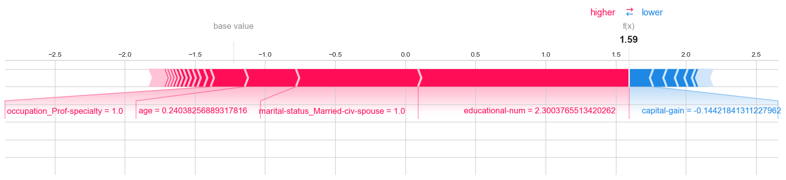
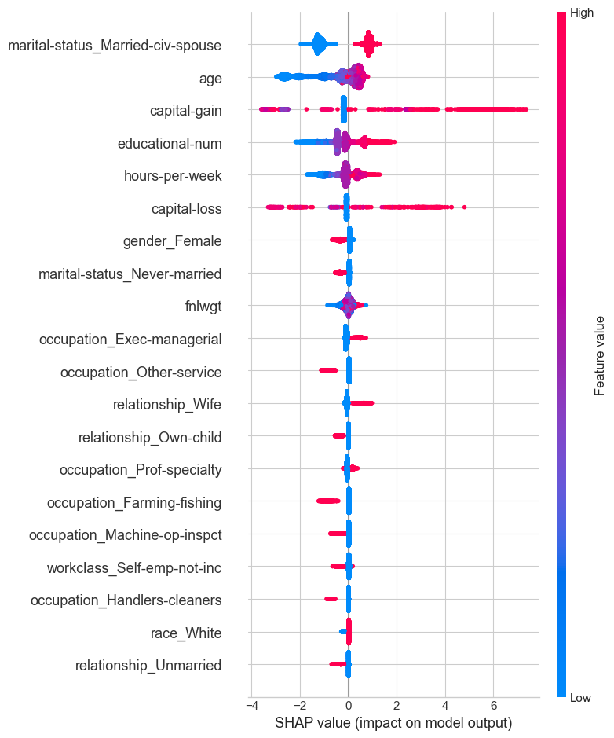
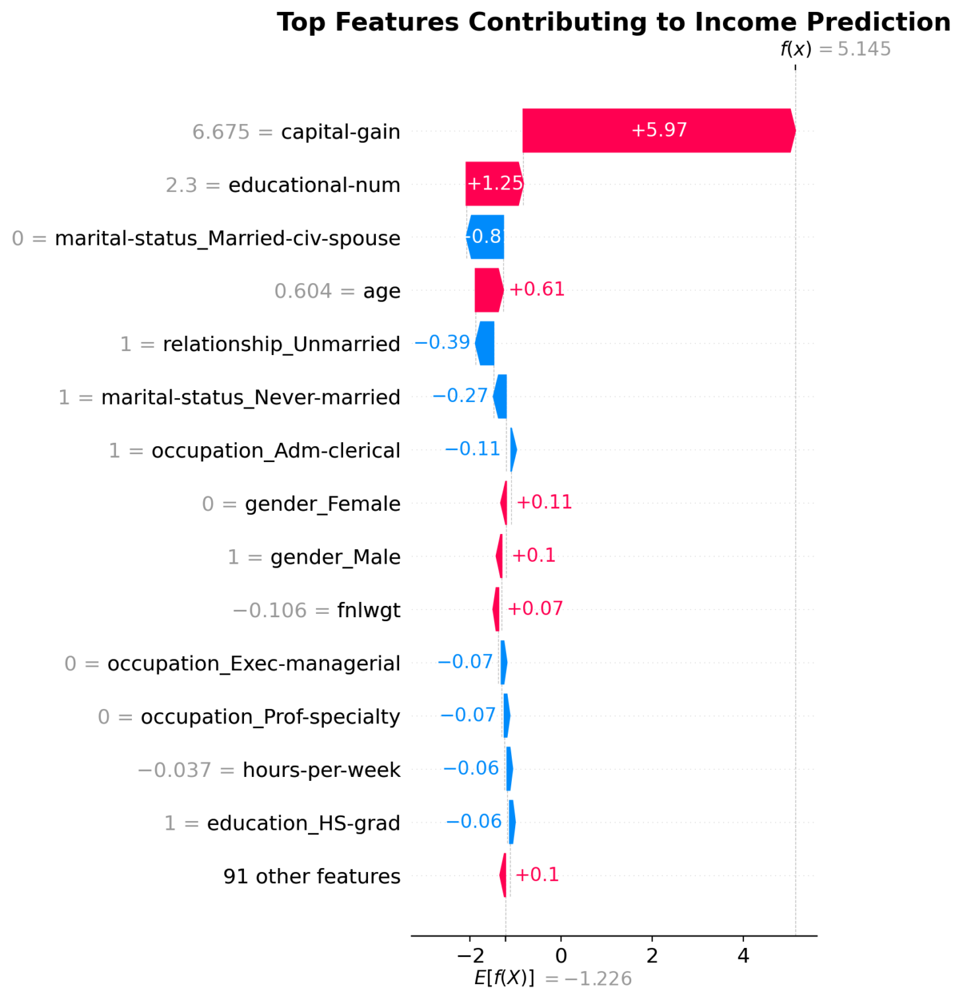

Great! Here's a **complete, professional `README.md`** tailored for your project `SalaryPreds` — highlighting that you’re a solo developer, and including sections for:

* Project intro
* Demo
* Features
* Tech stack
* Model evaluation (with placeholders for plots)
* SHAP explanation
* How to run locally
* Folder structure
* Credits

---

You can paste this directly into your `README.md` file:

---

````markdown
# 💰 SalaryPreds

**SalaryPreds** is an AI-powered web application that predicts whether a person earns more than $50,000 per year based on U.S. Census data. Built with a focus on **explainability**, the app not only makes predictions but also **visualizes the top features driving the decision using SHAP**.

> Developed solo by [Kanif Kumbhar](https://github.com/Kanif-Kumbhar) as a demonstration of full-stack ML deployment with Streamlit and XGBoost.

---

## 🚀 Live Demo

Coming soon...  
(You can run it locally using the instructions below 👇)

---

## 🎯 Features

- ✅ Predict income class (`<=50K` or `>50K`) using trained ML model
- ✅ Built-in preprocessing using pipelines (OneHot, StandardScaler, etc.)
- ✅ SHAP waterfall plot for individual prediction explanation
- ✅ Feature importance bar chart
- ✅ Responsive Streamlit UI with tooltips
- ✅ Fully open-source, reproducible ML workflow

---

## 📊 Model Evaluation

The model was trained and validated on the [UCI Adult Income Dataset](https://archive.ics.uci.edu/ml/datasets/adult). Several models were evaluated before finalizing `XGBoost`.

### 📌 Confusion Matrix (XGBoost)


### 📈 Shap Force Plot


### 📊 Shap Summary


> All visualizations were generated using `matplotlib`, `seaborn`, and `shap`.

---

## 🧠 SHAP Explanation

To ensure transparency, predictions are accompanied by **SHAP waterfall plots** explaining how each input feature influenced the decision.



---

## 🛠 Tech Stack

| Layer         | Tools Used                            |
|---------------|----------------------------------------|
| 👨‍💻 ML Model    | XGBoost, Scikit-learn Pipelines       |
| 📊 Explainability | SHAP                                 |
| 🧪 Preprocessing | OneHotEncoder, StandardScaler         |
| 🌐 Frontend    | Streamlit                             |
| 🔎 Visualization| Matplotlib, Seaborn                   |
| 🐍 Packaging   | pipreqs, joblib                        |

---

## 💻 Run Locally

1. **Clone the repository**
   ```bash
   git clone https://github.com/TheOddDev/SalaryPreds.git
   cd SalaryPreds
````

2. **Create and activate virtual environment**

   ```bash
   python -m venv venv
   venv\Scripts\activate   # On Windows
   source venv/bin/activate  # On macOS/Linux
   ```

3. **Install dependencies**

   ```bash
   pip install -r requirements.txt
   ```

4. **Run the app**

   ```bash
   streamlit run app.py
   ```

---

## 📁 Project Structure

```
SalaryPreds/
│
├── app.py                     # Streamlit frontend
├── model/
│   ├── income_model.pkl       # Trained model
│   └── preprocessor.pkl       # Scikit-learn pipeline
├── dataset/
│   └── adult.csv              # Training dataset
├── assets/
│   ├── confusion_matrix_xgb.png
│   ├── model_accuracy_comparison.png
│   └── shap_waterfall_example.png
├── requirements.txt
└── README.md
```

---

## 🧑‍💻 Developer

Made with ❤️ by **[Kanif Kumbhar](https://github.com/Kanif-Kumbhar)**

> "I build transparent and ethical AI apps that anyone can understand."

---

## 📜 License

This project is licensed under the [MIT License](LICENSE).

---

## 🙌 Acknowledgments

* UCI Machine Learning Repository – [Adult Income Dataset](https://archive.ics.uci.edu/ml/datasets/adult)
* [SHAP by Scott Lundberg](https://github.com/slundberg/shap)
* [Streamlit](https://streamlit.io/)

---

```

---

### ✅ Next Steps for You

1. Replace image placeholders (`assets/*.png`) with your actual plots.
2. Add your license (`LICENSE` file with MIT content).
3. Deploy your app on **Streamlit Cloud**, **Render**, or **HuggingFace Spaces** and update the demo link.
4. Optionally add badges (e.g., Python version, MIT License, etc.)

Would you like me to generate a `LICENSE` file for MIT or help you with deployment instructions too?
```
